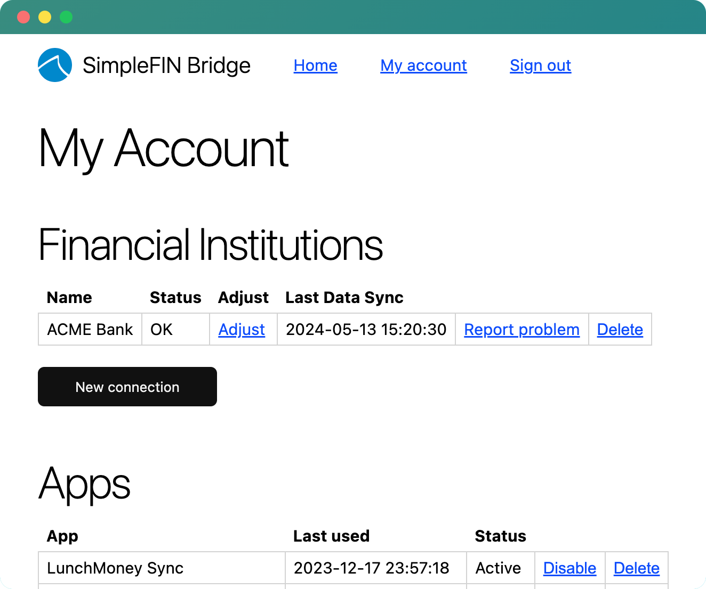
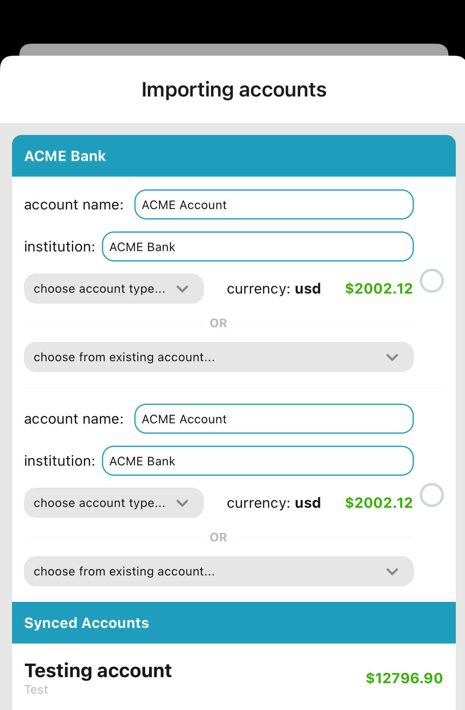
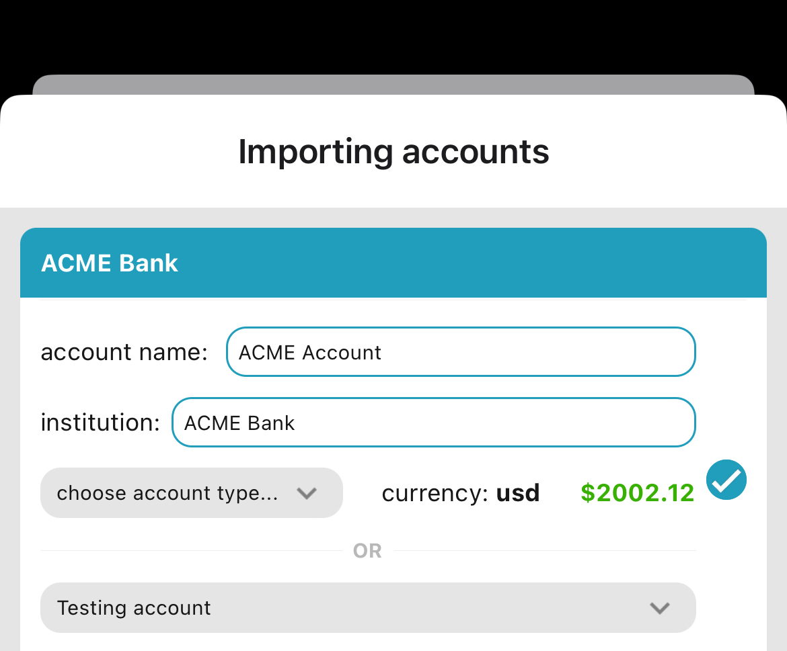
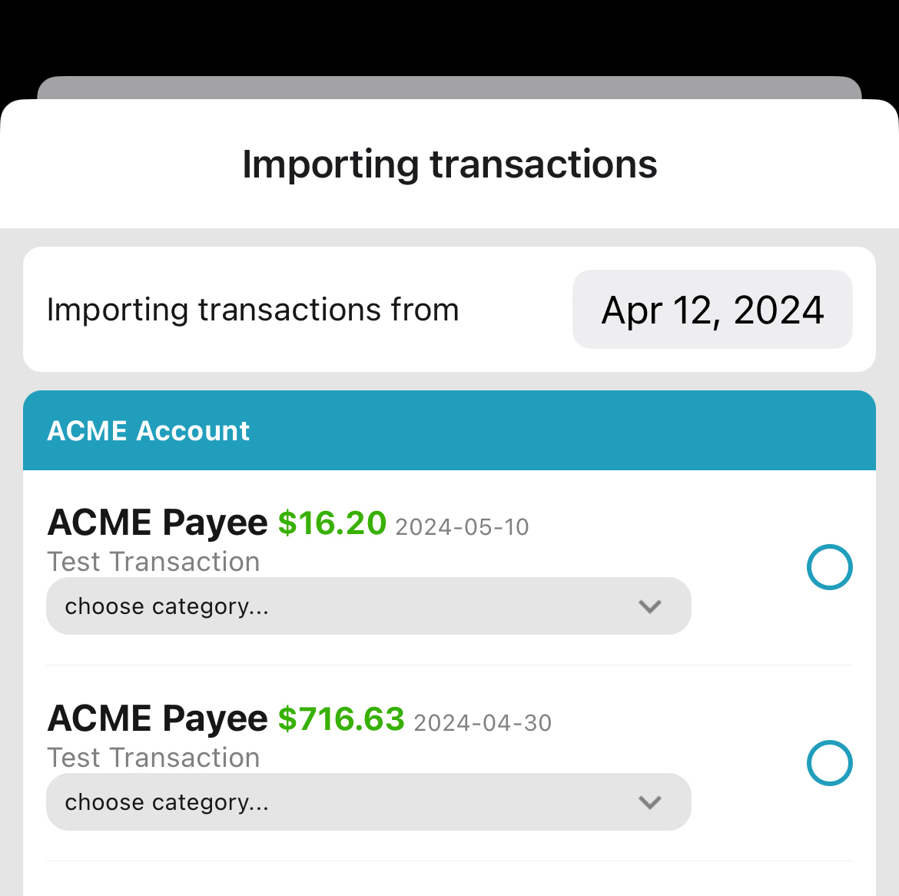

# Mobile App for Lunch Money (React Native)

## SimpleFIN Sync
### Tidbit on SimpleFIN Sync
  - premise of the sync is to get transaction data into Lunch Money
  - can show "found x new transactions to import, x new accounts"
    - before proceeding to import accounts, they must import accounts
      - we store account ID from SF to LM account ID mapping
  - show all transactions, try to map account as best as you can
    - for any unmapped account, we will import as cash transaction
    - we can't choose category so user will decide given existing categories
  - once ready, we validate and create transactions and all

### Walkthrough
#### SimpleFIN Setup Token
Assuming the setup token is given from SimpleFIN, you can now fetch data via SimpleFIN. If you need a setup token, go [here](https://bridge.simplefin.org/simplefin/create) and see some basic instructions [here](https://beta-bridge.simplefin.org/info/developers).

Make sure you've connected atleast one financial institution with your SimpleFIN account so there is data to pull.

When you add a new app to your SimpleFIN Bridge account, you will get a setup token. You can pass that into the mobile app under `Settings`.

After that, you can press `Fetch data via SimpleFIN` to start the fetching process.

#### Fetch from SimpleFIN
In the mobile app, once you've been able to save the setup token, you can press `Fetch data via SimpleFIN` in `Settings`. This will trigger the import accounts flow.

You will see your accounts available to import grouped by the institution along with any accounts we've already synced at the bottom.

**NOTE:** We determine synced accounts by mapping a Lunch Money account ID to the SimpleFIN account ID.

If you choose to import any account, you can update the account name and instituion name as you wish in the app with the given text boxes and choose the account type.

Another option is that you can choose to import that account and link it directly to some account that you already have in Lunch Money.

Once you're ready, you can check off the account on the right and you will see the bottom button update to reflect that you're importing said account.

Once you feel ready, you can move to the next step of importing any transactions.

**NOTE:** Between this move, we'll also sync balances of any synced accounts we found.

You will now see your transactions to import from the date specified onwards. So in this example, I am seeing transactions from April 12, 2024 til now. You can update the date if you wish.

The transactions are grouped by the account name. You can specify the category if you wish, the categories were sourced from Lunch Money directly. You can import the transaction without choosing a category, it will be marked as uncategorized.

If you wish to import a transaction, just select the checkbox on the right and the bottom button will update to reflect that change.

**NOTE:** If you import a transaction that belongs to an account that was not imported, the transaction will end up being a "Cash transaction".

Once you press the bottom button, all transactions will be imported into Lunch Money.

A caveat, the app does not auto-update to reflect all changes from this import right now but if you restart the app, you will see your changes.